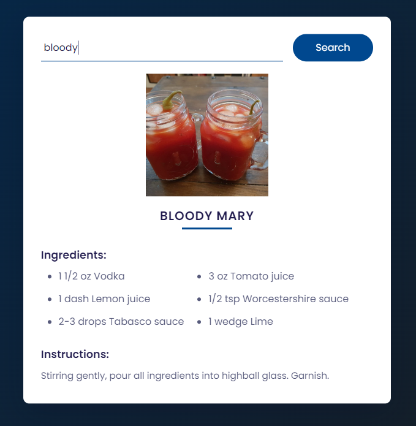

# Cocktail App

This repository contains the source code for a web application that allows users to search for cocktail recipes. It utilizes the [TheCocktailDB API](https://www.thecocktaildb.com/api.php) to fetch cocktail information based on user input.

## Features

- **Search**: Users can type the name of a cocktail in the search bar and click the "Search" button to retrieve information about that cocktail.
- **Display**: The app displays the name, image, list of ingredients, and instructions for preparing the cocktail.
- **Responsive Design**: The application is designed to be responsive, ensuring a seamless experience across different devices and screen sizes.

## Technologies Used: HTML, CSS & JavaScript

## Setup

To run this project locally, follow these steps:

1. Clone this repository to your local machine.
2. Open the `index.html` file in your web browser.

## Usage

1. Enter the name of a cocktail in the search input field.
2. Click the "Search" button.
3. View the details of the cocktail displayed on the screen.

## Screenshots

## Live Demo

You can try the live demo [here](https://arindal1.github.io/cocktail-recipe/).

## Contact

If you have any questions, suggestions, or just want to connect, feel free to reach out:

- GitHub: [arindal1](https://github.com/arindal1)
- LinkedIn: [arindalchar](https://www.linkedin.com/in/arindalchar/)
- Twitter: [arindal_17](https://twitter.com/arindal_17)

## License

This project is licensed under the MIT License - see the [LICENSE](LICENSE) file for details.

## Keep Coding 🚀
